# NINES Content Plan

The full curriculum as a **prerequisite graph**. The campaign map unlocks by prerequisites, not strict order. The source of truth is `src/content/graph.ts`; the tables below are generated from it with `npm run content:plan` (prose outside the markers is hand-written).

## How the graph is ordered

- **Track A (System Design)** is the campaign spine. Chapters follow Pigeon's growth: one server (A1) → growing pains (A2) → the network path (A3) → caching (A4) → the database (A5) → replication (A6) → partitioning (A7) → failure (A8) → async (A9) → APIs (A10) → operations (A11) → security (A12) → search and storage (A13). Chapters overlap: A3, A5, and A9 open early because their roots only need A1 fundamentals.
- **Track B (AI Engineering)** starts with no prerequisites (B1 is playable from day one) and pulls in Track A where it matters: production AI needs rate limiting, caching, retries, and observability; retrieval needs inverted indexes.
- **Track C (Dev Fundamentals)** is mostly independent and short. Linux (C2) comes before Containers (C1) in the graph because a container is a process with namespaces and cgroups; that is the click Bhagath is missing on Docker.
- **Track D (Case Intel Files)** unlocks late, each incident gated on the concepts needed to actually prove its root cause from logs and metrics. The capstone needs the legal-RAG case, the crawler, notifications, multi-tenancy, LLM cost controls, and the two Case Intel design missions.
- **Interview case studies** (kind *case*) are boss levels placed in the chapter where their last prerequisite lands. They run in Interview Arena format once that mode exists (Phase 3).
- **Transfer:** every boss, case, and incident interleaves concepts from earlier chapters without naming them.

## Accuracy log

| Date | Scope | Reviewer | Result |
|---|---|---|---|
| 2026-10-02 | A1 (six missions + Launch Day), INC-0001, B1 (Tokens, Context Windows, The Bill) | Workflow: 3 skeptical-staff-engineer fact-checkers → adversarial verifier → 4 fixers on disjoint files → auditor | 76 findings (12 wrong, 28 misleading, 10 stale, 26 nit). 72 survived verification, 4 refuted. All 72 applied, plus 19 honest-physics disclosures; the audit found 6 follow-ups, all fixed. Notable: an impossible 700 ms p50 in a latency review; 150 ms is California↔Netherlands (transatlantic is ~70 ms); ALB has no passive outlier ejection; gunicorn's default is 1 worker; "kernel panic" mislabelled an instant-fail app crash; Product Hunt's 00:01 PT is 12:31 IST only during PDT; the tokenizer-order answer contradicted the game's own tokenizer. Bosses and incidents gained an `honestPhysics` field. |

<!-- GENERATED:START -->

**240 nodes** · 0 verified · 11 built · 0 drafted · 229 planned

Legend: `·` planned, `✎` drafted (pack exists), `■` built (playable, lint green), `✔` verified (fact-checked + playtested). Kinds: concept, **boss**, *case* (interview case study boss), `incident`, `field`.

## Track A: System Design (Core Grid)

### A1 · Launch Day

*10 → 10k users.* One server, one launch, one very bad afternoon.

| Status | Node | Kind | Prerequisites | Signature interaction |
|---|---|---|---|---|
| ■ built | **Latency Numbers** `latency-numbers` | concept | none | Latency Ladder |
| ■ built | **Little's Law** `littles-law` | concept | `latency-numbers` | Queue Lab: the in-flight counter |
| ■ built | **Utilization & the Hockey Stick** `queueing-utilization` | concept | `littles-law` | Queue Lab: the load dial |
| ■ built | **Scale Up vs Scale Out** `scale-up-vs-out` | concept | `queueing-utilization` | Scale Lab |
| ■ built | **Load Balancers** `load-balancing` | concept | `scale-up-vs-out` | LB Lab |
| ■ built | **Stateless Services** `stateless-services` | concept | `load-balancing` | Session Shuffle |
| ■ built | **Boss: Launch Day** `boss-launch-day` | **boss** | `latency-numbers`, `littles-law`, `queueing-utilization`, `scale-up-vs-out`, `load-balancing`, `stateless-services` | Launch-day war room |
| ■ built | **INC-0001: The Fourth Box** `inc-fourth-box` | `incident` | `littles-law`, `load-balancing` | Incident Room |

<details><summary>Graph</summary>

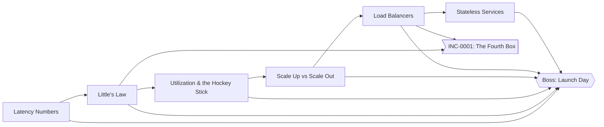

</details>

### A2 · Growing Pains

*10k → 100k users.* Tails, pools, and autoscalers that arrive late.

| Status | Node | Kind | Prerequisites | Signature interaction |
|---|---|---|---|---|
| · | **Tail Latency & Fan-out** `tail-latency` | concept | `queueing-utilization` | Fan-out Dice |
| · | **Estimation: QPS from Users** `estimation-qps` | concept | `latency-numbers` | Estimathon (worked → faded → solo) |
| · | **Estimation: Storage & Bandwidth** `estimation-storage` | concept | `estimation-qps` | Estimathon |
| · | **Estimation: Memory & Cache Sizing** `estimation-memory` | concept | `estimation-storage` | Estimathon |
| · | **Connection Pooling** `connection-pooling` | concept | `littles-law`, `scale-up-vs-out` | Pool Party |
| · | **Autoscaling & Its Lag** `autoscaling` | concept | `load-balancing`, `queueing-utilization` | Scaling Lag |
| · | **Boss: Viral Tuesday** `boss-viral-tuesday` | **boss** | `tail-latency`, `connection-pooling`, `autoscaling`, `estimation-memory` | Spike survival |
| · | **INC: The Pool Ran Dry** `inc-pool-exhaustion` | `incident` | `connection-pooling` | Incident Room |
| · | **Field: Load-test Your Own API** `field-load-test` | `field` | `queueing-utilization`, `tail-latency` | Field Mission |

<details><summary>Graph</summary>

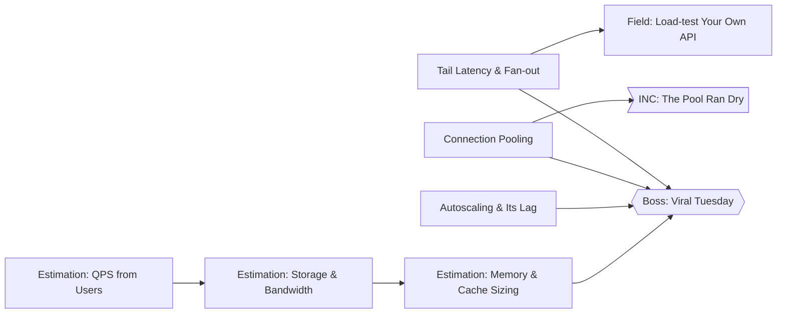

</details>

### A3 · The Request Journey

*Users outside Hyderabad.* Everything between a thumb and your code.

| Status | Node | Kind | Prerequisites | Signature interaction |
|---|---|---|---|---|
| · | **DNS** `dns` | concept | `latency-numbers` | Resolver Relay |
| · | **TCP vs UDP** `tcp-udp` | concept | `latency-numbers` | Handshake Hopscotch |
| · | **TLS Handshake** `tls-handshake` | concept | `tcp-udp` | Key Exchange |
| · | **HTTP/1.1 vs 2 vs 3** `http-versions` | concept | `tls-handshake` | Lane Race |
| · | **Keep-alive & Connection Reuse** `keep-alive` | concept | `http-versions`, `connection-pooling` | Handshake Tax |
| · | **Reverse Proxies (Nginx)** `reverse-proxy` | concept | `load-balancing`, `http-versions` | Server Block Sorter |
| · | **CDNs** `cdn` | concept | `dns`, `http-versions` | Edge Map |
| · | **Anycast** `anycast` | concept | `cdn` | Nearest Door |
| · | **Follow One Request** `request-journey` | concept | `dns`, `tls-handshake`, `http-versions`, `cdn`, `reverse-proxy` | End-to-end Journey |
| · | **Boss: Users in Jakarta** `boss-far-away-users` | **boss** | `request-journey`, `anycast`, `keep-alive` | Latency map |
| · | **INC: The Migration That Wouldn't Propagate** `inc-dns-ttl` | `incident` | `dns` | Incident Room |

<details><summary>Graph</summary>

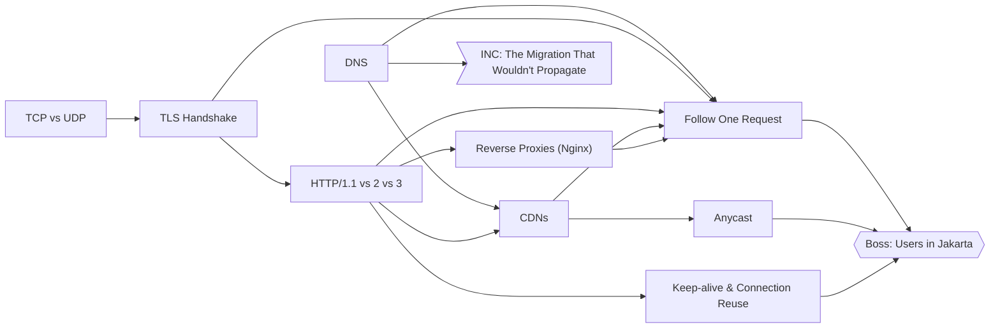

</details>

### A4 · Read Heavy

*1M users.* Caches: the fastest way to be fast, and wrong.

| Status | Node | Kind | Prerequisites | Signature interaction |
|---|---|---|---|---|
| · | **Cache-Aside & Hit Ratio** `cache-aside` | concept | `scale-up-vs-out`, `latency-numbers` | Cache Rush |
| · | **Zipf Traffic & Cache Sizing** `zipf-and-sizing` | concept | `cache-aside`, `estimation-memory` | Cache Rush: sizing |
| · | **Eviction: LRU vs LFU** `eviction-policies` | concept | `zipf-and-sizing` | Eviction Arena |
| · | **Write-through, Write-back, Write-around** `write-policies` | concept | `cache-aside` | Write Paths |
| · | **TTLs & Invalidation** `ttl-invalidation` | concept | `cache-aside` | Stale Hunter |
| · | **Cache Stampedes** `cache-stampede` | concept | `ttl-invalidation`, `queueing-utilization` | Stampede |
| · | **Hot Keys** `hot-keys` | concept | `zipf-and-sizing` | Hot Key Heatmap |
| · | **CDN Caching** `cdn-caching` | concept | `cdn`, `ttl-invalidation` | Edge Cache |
| · | **Boss: The Celebrity Post** `boss-celebrity-post` | **boss** | `cache-stampede`, `hot-keys`, `eviction-policies`, `cdn-caching`, `write-policies` | Viral read storm |
| · | **INC: Midnight Expiry** `inc-stampede` | `incident` | `cache-stampede` | Incident Room |

<details><summary>Graph</summary>

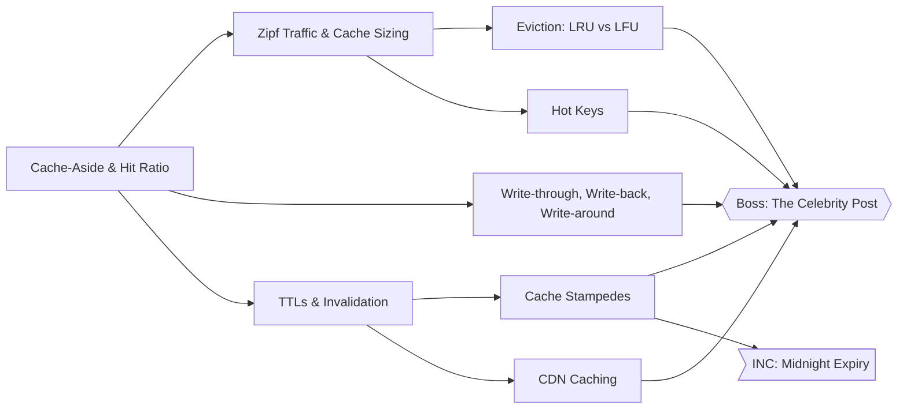

</details>

### A5 · The Database Wall

*Postgres is sweating.* Indexes, transactions, and the anomalies nobody warned you about.

| Status | Node | Kind | Prerequisites | Signature interaction |
|---|---|---|---|---|
| · | **Indexes & B-trees** `indexes-btree` | concept | `latency-numbers` | B-tree Builder |
| · | **Query Plans (EXPLAIN)** `query-plans` | concept | `indexes-btree` | EXPLAIN Detective |
| · | **Normalization vs Denormalization** `normalization` | concept | `indexes-btree` | Join or Copy |
| · | **Transactions & ACID** `transactions-acid` | concept | `normalization` | Crash Mid-Transfer |
| · | **Isolation Levels & Anomalies** `isolation-levels` | concept | `transactions-acid` | Isolation Race |
| · | **MVCC** `mvcc` | concept | `isolation-levels` | Version Chains |
| · | **SQL vs NoSQL Families** `sql-vs-nosql` | concept | `normalization` | Data Model Match |
| · | **LSM Trees vs B-trees** `lsm-vs-btree` | concept | `indexes-btree`, `sql-vs-nosql` | Compaction Clock |
| · | **When Postgres Is Enough** `postgres-is-enough` | concept | `mvcc`, `sql-vs-nosql`, `query-plans` | Stack Diet |
| · | **Boss: The Seat Rush** `boss-seat-rush` | **boss** | `isolation-levels`, `mvcc`, `query-plans` | Contention on one row |
| · | **Case: URL Shortener** `case-url-shortener` | *case* | `cache-aside`, `indexes-btree`, `estimation-storage` | Interview case |

<details><summary>Graph</summary>

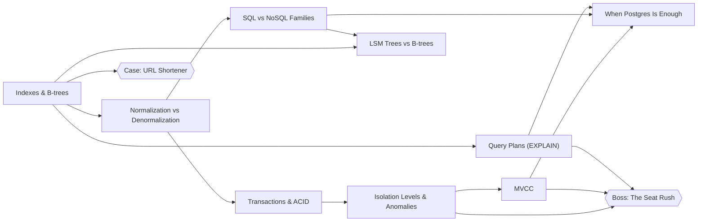

</details>

### A6 · Copies

*Read replicas.* Replication, lag, and who gets to be leader.

| Status | Node | Kind | Prerequisites | Signature interaction |
|---|---|---|---|---|
| · | **Leader-Follower Replication** `leader-follower` | concept | `transactions-acid`, `scale-up-vs-out` | Follow the Leader |
| · | **Sync vs Async Replication** `sync-async-replication` | concept | `leader-follower` | Ack Race |
| · | **Replication Lag Anomalies** `replication-lag` | concept | `sync-async-replication` | Lag Lens |
| · | **Failover & Split Brain** `failover` | concept | `leader-follower` | Promote! |
| · | **Multi-leader Replication** `multi-leader` | concept | `replication-lag` | Conflict Court |
| · | **Leaderless Replication & Quorums** `leaderless-quorums` | concept | `replication-lag` | Quorum Dial |
| · | **Boss: The Primary Is Gone** `boss-primary-down` | **boss** | `failover`, `replication-lag`, `leaderless-quorums` | Failover under fire |
| · | **INC: My Post Disappeared** `inc-replica-lag` | `incident` | `replication-lag` | Incident Room |

<details><summary>Graph</summary>

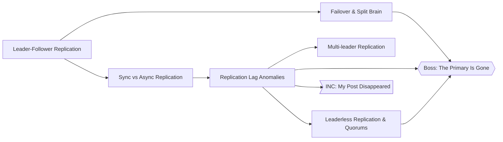

</details>

### A7 · Split

*10M users.* Sharding, hot partitions, and the ring.

| Status | Node | Kind | Prerequisites | Signature interaction |
|---|---|---|---|---|
| · | **Sharding Strategies** `sharding-strategies` | concept | `leader-follower`, `estimation-storage` | Range or Hash |
| · | **Choosing a Shard Key** `shard-keys` | concept | `sharding-strategies` | Key Picker |
| · | **Hot Partitions & the Celebrity Problem** `hot-partitions` | concept | `shard-keys`, `hot-keys` | Celebrity Problem |
| · | **Consistent Hashing & Virtual Nodes** `consistent-hashing` | concept | `sharding-strategies` | Hash Ring |
| · | **Rebalancing** `rebalancing` | concept | `consistent-hashing` | Move Fewer Keys |
| · | **Case: Distributed KV Store** `case-kv-store` | *case* | `consistent-hashing`, `leaderless-quorums`, `rebalancing`, `lsm-vs-btree` | Interview case |
| · | **INC: Shard 7 Is on Fire** `inc-hot-shard` | `incident` | `hot-partitions` | Incident Room |

<details><summary>Graph</summary>

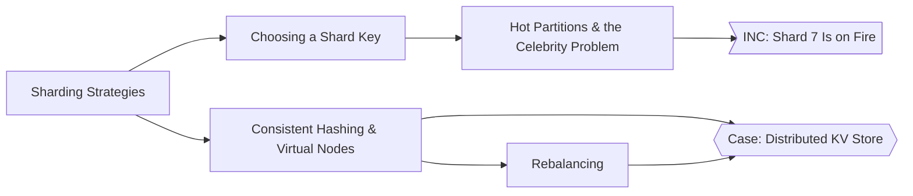

</details>

### A8 · Things Fail

*Microservices happened.* Timeouts, retries, consensus, and money that must not double.

| Status | Node | Kind | Prerequisites | Signature interaction |
|---|---|---|---|---|
| · | **Timeouts** `timeouts` | concept | `tail-latency` | Deadline Budget |
| · | **Retries, Backoff & Jitter** `retries-backoff-jitter` | concept | `timeouts` | Retry Storm |
| · | **Idempotency** `idempotency` | concept | `retries-backoff-jitter`, `transactions-acid` | Double Charge |
| · | **Circuit Breakers** `circuit-breakers` | concept | `retries-backoff-jitter` | Breaker Box |
| · | **Bulkheads** `bulkheads` | concept | `circuit-breakers`, `connection-pooling` | Watertight |
| · | **CAP & PACELC** `cap-pacelc` | concept | `replication-lag` | Partition Split |
| · | **Consistency Models** `consistency-models` | concept | `cap-pacelc` | Linearizable or Not |
| · | **Clocks & Ordering** `clocks-ordering` | concept | `consistency-models` | Clock Drift |
| · | **Consensus (Raft)** `consensus-raft` | concept | `failover`, `clocks-ordering` | Raft Arena |
| · | **Distributed Locks & Fencing Tokens** `distributed-locks` | concept | `consensus-raft`, `timeouts` | Lock Heist |
| · | **2PC vs Sagas** `two-pc-vs-sagas` | concept | `transactions-acid`, `idempotency` | Saga Steps |
| · | **The Outbox Pattern** `outbox-pattern` | concept | `two-pc-vs-sagas` | Dual Write Trap |
| · | **Case: Payment System** `case-payment-system` | *case* | `idempotency`, `two-pc-vs-sagas`, `outbox-pattern`, `isolation-levels` | Interview case |
| · | **Case: Ticket Booking (Seat Contention)** `case-ticket-booking` | *case* | `distributed-locks`, `isolation-levels`, `cache-aside` | Interview case |
| · | **INC: The Retry Storm** `inc-retry-storm` | `incident` | `retries-backoff-jitter` | Incident Room |

<details><summary>Graph</summary>

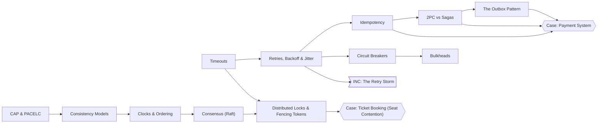

</details>

### A9 · Async

*Background everything.* Queues, logs, and messages that arrive twice.

| Status | Node | Kind | Prerequisites | Signature interaction |
|---|---|---|---|---|
| · | **Queues vs Logs (SQS vs Kafka)** `queues-vs-logs` | concept | `littles-law` | Queue Plumber |
| · | **Delivery Semantics & Dedup** `delivery-semantics` | concept | `queues-vs-logs`, `idempotency` | At-least-once |
| · | **Poison Messages & DLQs** `dlq-poison` | concept | `delivery-semantics` | Poison Pill |
| · | **Backpressure** `backpressure` | concept | `queues-vs-logs`, `queueing-utilization` | Pressure Valve |
| · | **Fan-out & Pub/Sub** `fan-out-pubsub` | concept | `queues-vs-logs` | Broadcast |
| · | **Event-driven Architecture** `event-driven` | concept | `fan-out-pubsub` | Event Web |
| · | **CQRS** `cqrs` | concept | `event-driven`, `replication-lag` | Two Models |
| · | **Event Sourcing** `event-sourcing` | concept | `cqrs` | Replay the Ledger |
| · | **Postgres as a Queue (SKIP LOCKED)** `postgres-queue` | concept | `queues-vs-logs`, `mvcc` | Lock Skipper |
| · | **Case: Notification System** `case-notification-system` | *case* | `fan-out-pubsub`, `dlq-poison`, `backpressure`, `idempotency` | Interview case |
| · | **Case: News Feed** `case-news-feed` | *case* | `fan-out-pubsub`, `cache-aside`, `hot-partitions` | Interview case |
| · | **Case: Web Crawler** `case-web-crawler` | *case* | `queues-vs-logs`, `backpressure`, `dns`, `rate-limiting` | Interview case |
| · | **INC: The Message That Kills Workers** `inc-poison-message` | `incident` | `dlq-poison` | Incident Room |

<details><summary>Graph</summary>

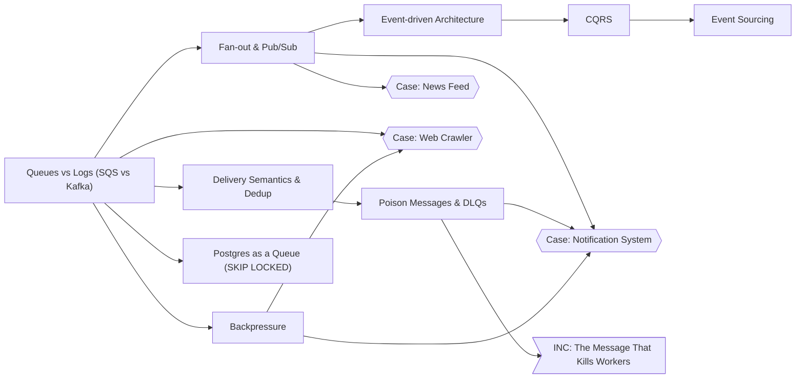

</details>

### A10 · The Front Door

*Public API.* Contracts, pagination, rate limits, and push.

| Status | Node | Kind | Prerequisites | Signature interaction |
|---|---|---|---|---|
| · | **REST vs gRPC vs GraphQL** `api-styles` | concept | `http-versions` | Contract Clash |
| · | **Offset vs Cursor Pagination** `pagination` | concept | `indexes-btree` | Page Drift |
| · | **Idempotency Keys** `idempotency-keys` | concept | `idempotency`, `api-styles` | Retry-safe POST |
| · | **API Versioning** `api-versioning` | concept | `api-styles` | Breaking Change |
| · | **Rate Limiting Algorithms** `rate-limiting` | concept | `queueing-utilization` | Token Bucket |
| · | **Polling, Long-polling, SSE, WebSockets** `realtime-transport` | concept | `http-versions`, `keep-alive` | Push or Pull |
| · | **Webhooks** `webhooks` | concept | `retries-backoff-jitter`, `idempotency-keys` | Callback Chaos |
| · | **Case: Distributed Rate Limiter** `case-rate-limiter` | *case* | `rate-limiting`, `cache-aside`, `consistent-hashing` | Interview case |
| · | **Case: Chat (WhatsApp)** `case-chat` | *case* | `realtime-transport`, `fan-out-pubsub`, `sharding-strategies`, `delivery-semantics` | Interview case |

<details><summary>Graph</summary>

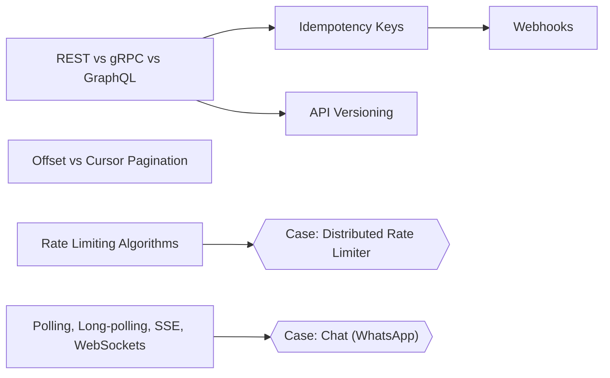

</details>

### A11 · Operate

*On-call rotation.* SLOs, signals, safe deploys, and region failures.

| Status | Node | Kind | Prerequisites | Signature interaction |
|---|---|---|---|---|
| · | **SLIs, SLOs & Error Budgets** `sli-slo-error-budgets` | concept | `tail-latency` | Budget Burn |
| · | **Logs, Metrics & Traces** `observability` | concept | `sli-slo-error-budgets` | Signal Hunt |
| · | **Blue-green & Canary Deploys** `deploy-strategies` | concept | `load-balancing`, `sli-slo-error-budgets` | Canary Cage |
| · | **Feature Flags** `feature-flags` | concept | `deploy-strategies` | Kill Switch |
| · | **Graceful Degradation** `graceful-degradation` | concept | `circuit-breakers`, `feature-flags` | Brownout |
| · | **RPO & RTO** `rpo-rto` | concept | `sync-async-replication` | Backup Clock |
| · | **Multi-region** `multi-region` | concept | `rpo-rto`, `cap-pacelc`, `anycast` | Two Continents |
| · | **Boss: Region Down (Game Day)** `boss-region-outage` | **boss** | `multi-region`, `graceful-degradation`, `observability` | Game day |

<details><summary>Graph</summary>

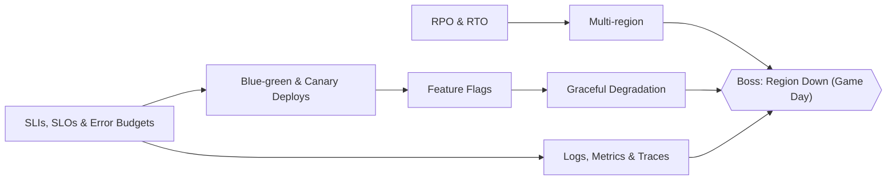

</details>

### A12 · Trust

*Enterprise customers.* Identity, tokens, tenants, and secrets.

| Status | Node | Kind | Prerequisites | Signature interaction |
|---|---|---|---|---|
| · | **AuthN vs AuthZ** `authn-authz` | concept | `stateless-services` | Who vs What |
| · | **Sessions vs JWT** `sessions-vs-jwt` | concept | `authn-authz` | Token Trouble |
| · | **OAuth2 & OIDC Flows** `oauth-oidc` | concept | `sessions-vs-jwt` | Redirect Dance |
| · | **OWASP Top Risks** `owasp-top-risks` | concept | `authn-authz` | Break This App |
| · | **Secrets Management** `secrets-management` | concept | `owasp-top-risks` | Leaked Key |
| · | **Multi-tenant Isolation** `multi-tenant-isolation` | concept | `authn-authz`, `sharding-strategies` | Tenant Wall |
| · | **Boss: The Breach** `boss-breach` | **boss** | `oauth-oidc`, `owasp-top-risks`, `secrets-management`, `multi-tenant-isolation` | Breach response |

<details><summary>Graph</summary>

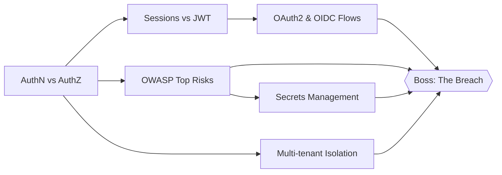

</details>

### A13 · Find Everything

*100M users.* Blobs, search, maps, and time.

| Status | Node | Kind | Prerequisites | Signature interaction |
|---|---|---|---|---|
| · | **Blob Storage** `blob-storage` | concept | `cdn` | Bucket Brigade |
| · | **Inverted Indexes** `inverted-index` | concept | `indexes-btree` | Posting Lists |
| · | **Geospatial Indexes** `geospatial-index` | concept | `indexes-btree` | Geohash Grid |
| · | **Time-series Data** `time-series` | concept | `lsm-vs-btree` | Downsample |
| · | **Case: Search Autocomplete** `case-autocomplete` | *case* | `inverted-index`, `cache-aside`, `estimation-memory` | Interview case |
| · | **Case: Ride Hailing (Uber)** `case-ride-hailing` | *case* | `geospatial-index`, `realtime-transport`, `sharding-strategies` | Interview case |
| · | **Case: Video Pipeline (YouTube)** `case-video-pipeline` | *case* | `blob-storage`, `queues-vs-logs`, `cdn-caching` | Interview case |

<details><summary>Graph</summary>

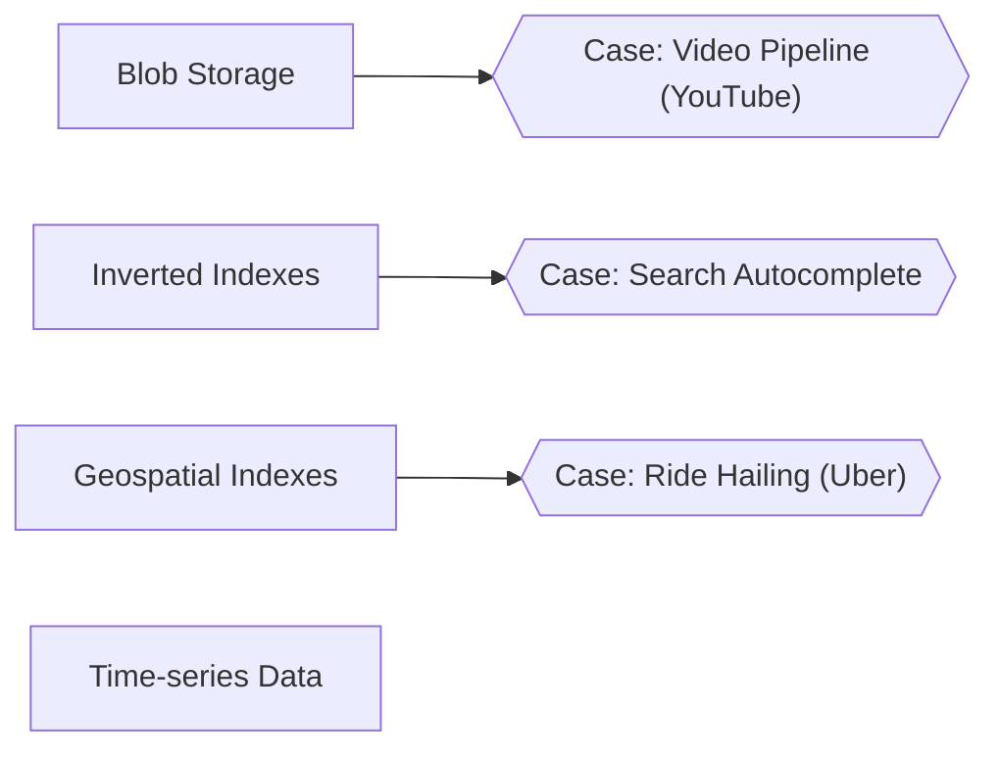

</details>

## Track B: AI Engineering (Agent Foundry)

### B1 · Tokens & Context

*Pigeon Copilot, day one.* What the model actually sees, and what it costs.

| Status | Node | Kind | Prerequisites | Signature interaction |
|---|---|---|---|---|
| ■ built | **Tokens & Tokenization** `tokens` | concept | none | Tokenizer Slicer |
| ■ built | **Context Windows** `context-windows` | concept | `tokens` | Context Tetris |
| ■ built | **Boss: The Bill** `boss-the-bill` | **boss** | `tokens`, `context-windows` | History vs budget |

<details><summary>Graph</summary>


</details>

### B2 · How Models Behave

*The demo went well.* Sampling, hallucination, speed, and the bill.

| Status | Node | Kind | Prerequisites | Signature interaction |
|---|---|---|---|---|
| · | **Sampling: Temperature & Top-p** `sampling` | concept | `tokens` | Distribution Dial |
| · | **Why Models Hallucinate** `hallucination` | concept | `sampling` | Confident Nonsense |
| · | **Time-to-first-token vs Throughput** `ttft-throughput` | concept | `tokens`, `littles-law` | Stream Race |
| · | **LLM Cost Math** `llm-cost-math` | concept | `tokens`, `estimation-qps` | Token Meter |

<details><summary>Graph</summary>

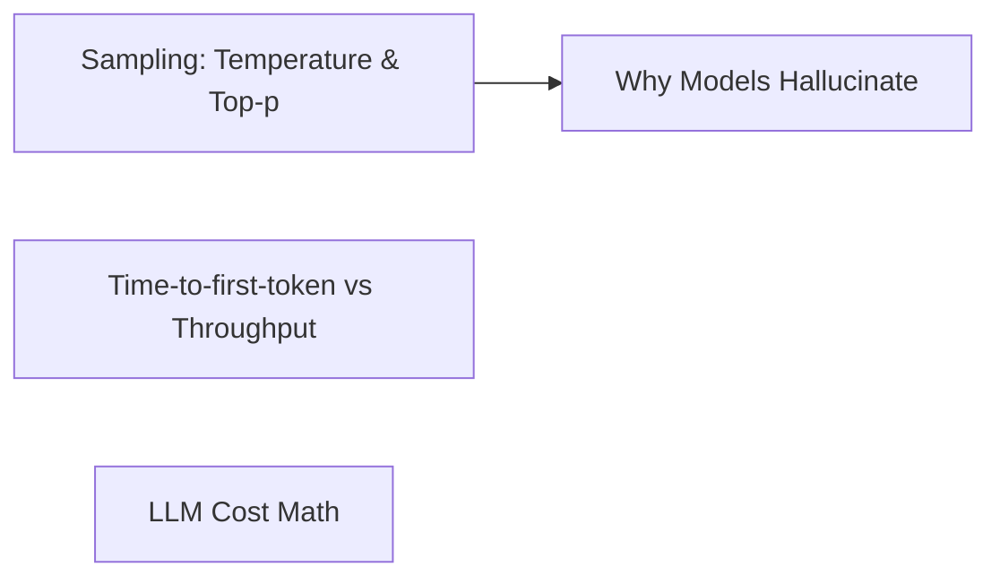

</details>

### B3 · Prompting as Engineering

*Prompts in production.* Structure, schemas, caching, and versions.

| Status | Node | Kind | Prerequisites | Signature interaction |
|---|---|---|---|---|
| · | **System Prompts** `system-prompts` | concept | `context-windows` | Role Call |
| · | **Structure & Examples** `prompt-structure` | concept | `system-prompts` | Prompt Surgery |
| · | **Extended Thinking** `extended-thinking` | concept | `prompt-structure`, `llm-cost-math` | Think Budget |
| · | **Structured Outputs** `structured-outputs` | concept | `prompt-structure` | Schema Lock |
| · | **Prompt Caching** `prompt-caching` | concept | `context-windows`, `llm-cost-math` | Cache the Prefix |
| · | **Prompt Versioning** `prompt-versioning` | concept | `prompt-structure` | Prompt Diff |
| · | **Field: Telegram Link Summarizer** `field-telegram-summarizer` | `field` | `structured-outputs`, `context-windows` | Field Mission |

<details><summary>Graph</summary>

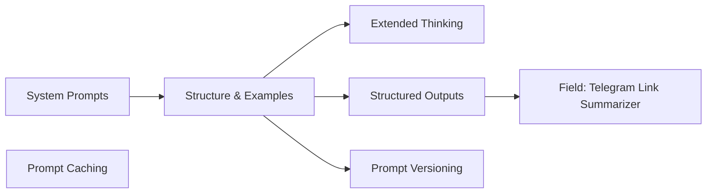

</details>

### B4 · Retrieval

*Answers from our data.* Embeddings, hybrid search, reranking, and measuring it.

| Status | Node | Kind | Prerequisites | Signature interaction |
|---|---|---|---|---|
| · | **Embeddings** `embeddings` | concept | `tokens` | Embedding Space Explorer |
| · | **Cosine Similarity** `cosine-similarity` | concept | `embeddings` | Angle Finder |
| · | **Bi-encoders vs Cross-encoders** `bi-vs-cross-encoder` | concept | `cosine-similarity` | Two Towers |
| · | **Chunking Strategies** `chunking` | concept | `embeddings`, `context-windows` | Chunk Chef |
| · | **BM25** `bm25` | concept | `inverted-index` | Term Weights |
| · | **Hybrid Search & RRF** `hybrid-search-rrf` | concept | `bm25`, `cosine-similarity` | RRF Mixer |
| · | **HyDE** `hyde` | concept | `hybrid-search-rrf` | Hypothetical Answer |
| · | **Reranking** `reranking` | concept | `bi-vs-cross-encoder`, `hybrid-search-rrf` | Rerank Relay |
| · | **Metadata Filtering** `metadata-filtering` | concept | `hybrid-search-rrf` | Filter First? |
| · | **HNSW vs IVF** `ann-indexes` | concept | `cosine-similarity` | Graph Hop |
| · | **Retrieval Evals (recall@k, MRR, nDCG)** `retrieval-eval` | concept | `reranking` | Rank Judge |

<details><summary>Graph</summary>

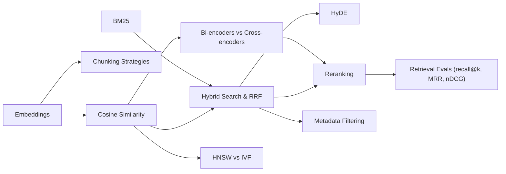

</details>

### B5 · Evals

*Did that prompt change break anything?.* The discipline most teams skip.

| Status | Node | Kind | Prerequisites | Signature interaction |
|---|---|---|---|---|
| · | **Building Eval Sets** `eval-test-sets` | concept | `structured-outputs` | Golden Set |
| · | **Code-based Graders** `code-graders` | concept | `eval-test-sets` | Assert It |
| · | **LLM-as-Judge** `llm-as-judge` | concept | `code-graders` | Judge the Judge |
| · | **Prompt Regression Testing** `prompt-regression` | concept | `llm-as-judge`, `prompt-versioning` | Eval Lab |
| · | **Offline vs Online Evals** `offline-online-evals` | concept | `prompt-regression`, `sli-slo-error-budgets` | Shadow Traffic |
| · | **Boss: Ship the Prompt** `boss-ship-the-prompt` | **boss** | `prompt-regression`, `offline-online-evals`, `retrieval-eval` | Eval gauntlet |
| · | **Field: An Eval Suite for Case Intel Search** `field-search-evals` | `field` | `retrieval-eval`, `prompt-regression` | Field Mission |

<details><summary>Graph</summary>

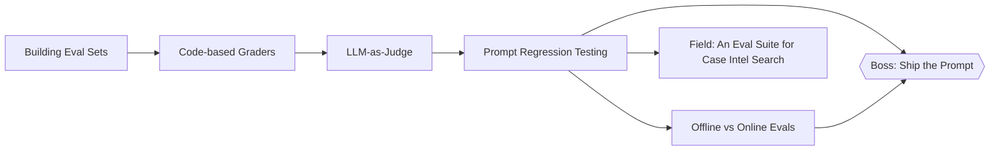

</details>

### B6 · Tools & Agents

*The model can act now.* Loops, plans, memory, and when not to use an agent.

| Status | Node | Kind | Prerequisites | Signature interaction |
|---|---|---|---|---|
| · | **Tool Calling & JSON Schemas** `tool-calling` | concept | `structured-outputs` | Schema Smith |
| · | **The Agent Loop** `agent-loop` | concept | `tool-calling` | Loop Stepper |
| · | **ReAct** `react-pattern` | concept | `agent-loop` | Think-Act-Observe |
| · | **Planning** `planning` | concept | `react-pattern` | Plan Board |
| · | **Short- vs Long-term Memory** `agent-memory` | concept | `agent-loop`, `embeddings` | Memory Palace |
| · | **Agent Failure Modes** `agent-failure-modes` | concept | `agent-loop` | Agent Debugger |
| · | **Human-in-the-loop** `human-in-the-loop` | concept | `agent-failure-modes` | Approval Gate |
| · | **Workflows vs Agents** `workflows-vs-agents` | concept | `agent-loop` | Do You Need an Agent? |
| · | **Orchestrator-Worker** `orchestrator-worker` | concept | `workflows-vs-agents` | Dispatch |
| · | **Parallelization** `parallelization` | concept | `orchestrator-worker`, `tail-latency` | Fan-out Agents |
| · | **Multi-agent Patterns** `multi-agent` | concept | `orchestrator-worker` | Agent Org Chart |
| · | **Boss: The Agent That Wouldn't Stop** `boss-agent-meltdown` | **boss** | `agent-failure-modes`, `human-in-the-loop`, `planning` | Live agent triage |
| · | **INC: $400 of Tool Calls** `inc-agent-loop` | `incident` | `agent-failure-modes` | Incident Room |

<details><summary>Graph</summary>

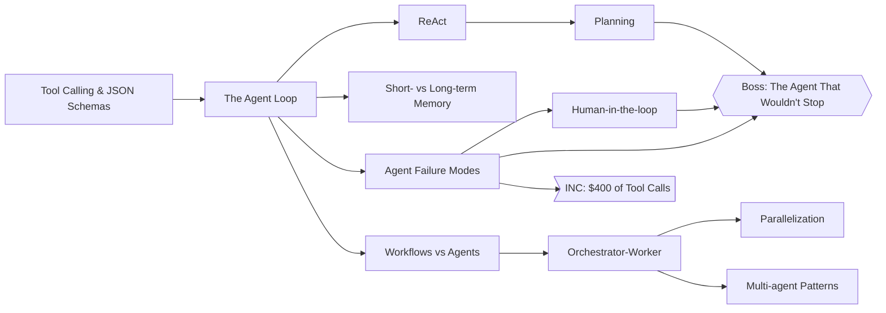

</details>

### B7 · MCP

*Plug it into everything.* Hosts, clients, servers, and transports.

| Status | Node | Kind | Prerequisites | Signature interaction |
|---|---|---|---|---|
| · | **MCP: Host, Client, Server** `mcp-architecture` | concept | `tool-calling` | Wire It Up |
| · | **MCP Transports** `mcp-transports` | concept | `mcp-architecture`, `realtime-transport` | stdio or HTTP |
| · | **Tools, Resources & Prompts** `mcp-primitives` | concept | `mcp-architecture` | Primitive Sort |
| · | **Build an MCP Server** `mcp-build-server` | concept | `mcp-primitives`, `mcp-transports` | Server Forge |
| · | **Field: Write an MCP Server** `field-mcp-server` | `field` | `mcp-build-server` | Field Mission |

<details><summary>Graph</summary>

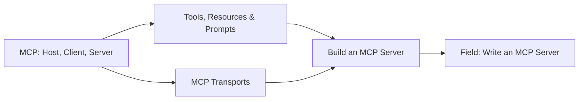

</details>

### B8 · Agentic Coding

*The team codes with agents.* How coding agents work and how to direct them.

| Status | Node | Kind | Prerequisites | Signature interaction |
|---|---|---|---|---|
| · | **How Claude Code Works** `claude-code-anatomy` | concept | `agent-loop`, `context-windows` | Context Inspector |
| · | **Directing Coding Agents** `directing-coding-agents` | concept | `claude-code-anatomy` | Brief the Bot |

<details><summary>Graph</summary>

```mermaid
flowchart LR
  claude_code_anatomy["How Claude Code Works"]
  directing_coding_agents["Directing Coding Agents"]
  claude_code_anatomy --> directing_coding_agents
```

</details>

### B9 · Production AI

*Millions of LLM calls a day.* Gateways, routing, caching, tracing, and cost.

| Status | Node | Kind | Prerequisites | Signature interaction |
|---|---|---|---|---|
| · | **LLM Gateways** `llm-gateway` | concept | `reverse-proxy`, `rate-limiting` | Gateway Guard |
| · | **Routing by Cost, Quality & Latency** `model-routing` | concept | `llm-gateway`, `llm-cost-math` | Model Router |
| · | **Semantic Caching** `semantic-caching` | concept | `cache-aside`, `cosine-similarity` | Near Miss |
| · | **LLM Rate Limits & Retries** `llm-rate-limits-retries` | concept | `retries-backoff-jitter`, `llm-gateway` | 429 Storm |
| · | **Streaming Responses** `streaming` | concept | `realtime-transport`, `ttft-throughput` | Token Stream |
| · | **Tracing Prompts & Tool Calls** `llm-tracing` | concept | `observability`, `agent-loop` | Trace Viewer |
| · | **Guardrails** `guardrails` | concept | `structured-outputs` | Guard Post |
| · | **PII Handling** `pii-handling` | concept | `guardrails` | Redact |
| · | **LLM Cost Controls** `llm-cost-controls` | concept | `model-routing`, `prompt-caching` | Budget Cap |
| · | **INC: The 429 Storm** `inc-429-storm` | `incident` | `llm-rate-limits-retries` | Incident Room |

<details><summary>Graph</summary>

```mermaid
flowchart LR
  llm_gateway["LLM Gateways"]
  model_routing["Routing by Cost, Quality & Latency"]
  semantic_caching["Semantic Caching"]
  llm_rate_limits_retries["LLM Rate Limits & Retries"]
  streaming["Streaming Responses"]
  llm_tracing["Tracing Prompts & Tool Calls"]
  guardrails["Guardrails"]
  pii_handling["PII Handling"]
  llm_cost_controls["LLM Cost Controls"]
  inc_429_storm>"INC: The 429 Storm"]
  llm_gateway --> model_routing
  llm_gateway --> llm_rate_limits_retries
  guardrails --> pii_handling
  model_routing --> llm_cost_controls
  llm_rate_limits_retries --> inc_429_storm
```

</details>

### B10 · AI Security

*Someone is attacking Copilot.* Injection, exfiltration, least privilege.

| Status | Node | Kind | Prerequisites | Signature interaction |
|---|---|---|---|---|
| · | **Direct Prompt Injection** `prompt-injection-direct` | concept | `system-prompts` | Prompt Injection Heist |
| · | **Indirect Prompt Injection** `prompt-injection-indirect` | concept | `prompt-injection-direct`, `tool-calling` | Poisoned Document |
| · | **Exfiltration Through Tools** `tool-exfiltration` | concept | `prompt-injection-indirect` | Leaky Tool |
| · | **Least-privilege Tool Design** `least-privilege-tools` | concept | `tool-exfiltration` | Scope It Down |
| · | **INC: The Support Bot Said What?** `inc-injected-support-bot` | `incident` | `prompt-injection-indirect` | Incident Room |

<details><summary>Graph</summary>

```mermaid
flowchart LR
  prompt_injection_direct["Direct Prompt Injection"]
  prompt_injection_indirect["Indirect Prompt Injection"]
  tool_exfiltration["Exfiltration Through Tools"]
  least_privilege_tools["Least-privilege Tool Design"]
  inc_injected_support_bot>"INC: The Support Bot Said What?"]
  prompt_injection_direct --> prompt_injection_indirect
  prompt_injection_indirect --> tool_exfiltration
  tool_exfiltration --> least_privilege_tools
  prompt_injection_indirect --> inc_injected_support_bot
```

</details>

### B11 · Beyond Prompting

*Should we fine-tune?.* RAG vs fine-tuning, LoRA, quantization, local models.

| Status | Node | Kind | Prerequisites | Signature interaction |
|---|---|---|---|---|
| · | **Prompting vs RAG vs Fine-tuning** `rag-vs-finetune` | concept | `chunking`, `prompt-structure` | Decision Tree |
| · | **LoRA Intuition** `lora` | concept | `rag-vs-finetune` | Low-rank Dial |
| · | **Quantization** `quantization` | concept | `rag-vs-finetune` | Bit Squeeze |
| · | **Running Local Models** `local-models` | concept | `quantization` | Fit in 6GB |

<details><summary>Graph</summary>

```mermaid
flowchart LR
  rag_vs_finetune["Prompting vs RAG vs Fine-tuning"]
  lora["LoRA Intuition"]
  quantization["Quantization"]
  local_models["Running Local Models"]
  rag_vs_finetune --> lora
  rag_vs_finetune --> quantization
  quantization --> local_models
```

</details>

### B12 · AI System Design

*Interview loop: AI edition.* Whole AI systems, end to end.

| Status | Node | Kind | Prerequisites | Signature interaction |
|---|---|---|---|---|
| · | **Case: ChatGPT-style Chat Service** `case-chat-service` | *case* | `streaming`, `context-windows`, `llm-rate-limits-retries`, `case-chat` | Interview case |
| · | **Case: Legal-document RAG at Scale** `case-legal-rag` | *case* | `retrieval-eval`, `hybrid-search-rrf`, `multi-tenant-isolation`, `chunking` | Interview case |
| · | **Case: AI Coding Agent** `case-coding-agent` | *case* | `claude-code-anatomy`, `agent-failure-modes`, `least-privilege-tools` | Interview case |
| · | **Case: LLM Gateway** `case-llm-gateway` | *case* | `llm-gateway`, `model-routing`, `llm-cost-controls`, `semantic-caching` | Interview case |
| · | **Case: Support Agent with Human Escalation** `case-support-agent` | *case* | `human-in-the-loop`, `guardrails`, `retrieval-eval` | Interview case |
| · | **Case: Document-processing Pipeline** `case-doc-pipeline` | *case* | `queues-vs-logs`, `structured-outputs`, `dlq-poison` | Interview case |

<details><summary>Graph</summary>

```mermaid
flowchart LR
  case_chat_service{{"Case: ChatGPT-style Chat Service"}}
  case_legal_rag{{"Case: Legal-document RAG at Scale"}}
  case_coding_agent{{"Case: AI Coding Agent"}}
  case_llm_gateway{{"Case: LLM Gateway"}}
  case_support_agent{{"Case: Support Agent with Human Escalation"}}
  case_doc_pipeline{{"Case: Document-processing Pipeline"}}
```

</details>

## Track C: Dev Fundamentals (The Yard)

### C1 · Containers

*It works on my machine.* Docker from zero, then Kubernetes.

| Status | Node | Kind | Prerequisites | Signature interaction |
|---|---|---|---|---|
| · | **What a Container Actually Is** `container-basics` | concept | `processes-signals` | Namespace Nesting |
| · | **Images & Layers** `docker-images-layers` | concept | `container-basics` | Docker Layers |
| · | **Dockerfile Build Cache** `dockerfile-cache` | concept | `docker-images-layers` | Cache Busting |
| · | **Volumes & Persistence** `docker-volumes` | concept | `docker-images-layers` | Where Did My Data Go |
| · | **Container Networking** `docker-networking` | concept | `container-basics`, `dns` | Port Maze |
| · | **Docker Compose** `docker-compose` | concept | `docker-volumes`, `docker-networking` | Compose Up |
| · | **Kubernetes Core** `kubernetes-core` | concept | `docker-compose`, `load-balancing` | Cluster Keeper |
| · | **Probes, Limits & HPA** `kubernetes-probes-scaling` | concept | `kubernetes-core`, `autoscaling`, `memory-oom` | Pod Doctor |
| · | **Field: Containerize Case Intel** `field-containerize-app` | `field` | `docker-compose` | Field Mission |
| · | **INC: CrashLoopBackOff** `inc-oom-container` | `incident` | `kubernetes-probes-scaling` | Incident Room |

<details><summary>Graph</summary>

```mermaid
flowchart LR
  container_basics["What a Container Actually Is"]
  docker_images_layers["Images & Layers"]
  dockerfile_cache["Dockerfile Build Cache"]
  docker_volumes["Volumes & Persistence"]
  docker_networking["Container Networking"]
  docker_compose["Docker Compose"]
  kubernetes_core["Kubernetes Core"]
  kubernetes_probes_scaling["Probes, Limits & HPA"]
  field_containerize_case_intel["Field: Containerize Case Intel"]
  inc_oom_container>"INC: CrashLoopBackOff"]
  container_basics --> docker_images_layers
  docker_images_layers --> dockerfile_cache
  docker_images_layers --> docker_volumes
  container_basics --> docker_networking
  docker_volumes --> docker_compose
  docker_networking --> docker_compose
  docker_compose --> kubernetes_core
  kubernetes_core --> kubernetes_probes_scaling
  docker_compose --> field_containerize_case_intel
  kubernetes_probes_scaling --> inc_oom_container
```

</details>

### C2 · Linux for Servers

*SSH at 3am.* Processes, memory, OOM, systemd, logs.

| Status | Node | Kind | Prerequisites | Signature interaction |
|---|---|---|---|---|
| · | **Processes & Signals** `processes-signals` | concept | none | Process Tree |
| · | **Memory & the OOM Killer** `memory-oom` | concept | `processes-signals` | OOM Roulette |
| · | **File Descriptors** `file-descriptors` | concept | `processes-signals` | Too Many Open Files |
| · | **systemd Units** `systemd` | concept | `processes-signals` | Unit Doctor |
| · | **Reading Logs (journalctl, dmesg)** `reading-logs` | concept | `systemd`, `memory-oom` | Log Diver |
| · | **Burstable CPU & Credits** `cpu-credits` | concept | `queueing-utilization` | Credit Drain |

<details><summary>Graph</summary>

```mermaid
flowchart LR
  processes_signals["Processes & Signals"]
  memory_oom["Memory & the OOM Killer"]
  file_descriptors["File Descriptors"]
  systemd["systemd Units"]
  reading_logs["Reading Logs (journalctl, dmesg)"]
  cpu_credits["Burstable CPU & Credits"]
  processes_signals --> memory_oom
  processes_signals --> file_descriptors
  processes_signals --> systemd
  systemd --> reading_logs
  memory_oom --> reading_logs
```

</details>

### C3 · Git Beyond Basics

*Someone force-pushed.* The DAG, rebases, and reflog rescues.

| Status | Node | Kind | Prerequisites | Signature interaction |
|---|---|---|---|---|
| · | **The Commit DAG** `git-dag` | concept | none | Git DAG |
| · | **Merge vs Rebase** `merge-vs-rebase` | concept | `git-dag` | Rewrite History |
| · | **Cherry-pick & Reset** `cherry-pick-reset` | concept | `merge-vs-rebase` | Surgeon |
| · | **Reflog Rescues** `reflog-rescue` | concept | `cherry-pick-reset` | Undo the Undo |

<details><summary>Graph</summary>

```mermaid
flowchart LR
  git_dag["The Commit DAG"]
  merge_vs_rebase["Merge vs Rebase"]
  cherry_pick_reset["Cherry-pick & Reset"]
  reflog_rescue["Reflog Rescues"]
  git_dag --> merge_vs_rebase
  merge_vs_rebase --> cherry_pick_reset
  cherry_pick_reset --> reflog_rescue
```

</details>

### C4 · Ship It

*Deploys on Fridays.* Pipelines and infrastructure as code.

| Status | Node | Kind | Prerequisites | Signature interaction |
|---|---|---|---|---|
| · | **CI/CD Pipelines** `ci-pipelines` | concept | `git-dag`, `docker-images-layers` | Pipeline Builder |
| · | **Infrastructure as Code** `iac-basics` | concept | `ci-pipelines` | Plan & Apply |
| · | **Field: CI for Case Intel** `field-gh-actions` | `field` | `ci-pipelines` | Field Mission |

<details><summary>Graph</summary>

```mermaid
flowchart LR
  ci_pipelines["CI/CD Pipelines"]
  iac_basics["Infrastructure as Code"]
  field_gh_actions["Field: CI for Case Intel"]
  ci_pipelines --> iac_basics
  ci_pipelines --> field_gh_actions
```

</details>

### C5 · Concurrency

*Two requests, one row.* Threads, processes, async, the GIL, races, deadlocks.

| Status | Node | Kind | Prerequisites | Signature interaction |
|---|---|---|---|---|
| · | **Threads vs Processes vs Async** `threads-processes-async` | concept | `processes-signals`, `littles-law` | Worker Models |
| · | **Python's GIL** `python-gil` | concept | `threads-processes-async` | The Big Lock |
| · | **Race Conditions** `race-conditions` | concept | `threads-processes-async` | Race Replay |
| · | **Locks & Deadlocks** `locks-deadlocks` | concept | `race-conditions` | Dining Deadlock |

<details><summary>Graph</summary>

```mermaid
flowchart LR
  threads_processes_async["Threads vs Processes vs Async"]
  python_gil["Python's GIL"]
  race_conditions["Race Conditions"]
  locks_deadlocks["Locks & Deadlocks"]
  threads_processes_async --> python_gil
  threads_processes_async --> race_conditions
  race_conditions --> locks_deadlocks
```

</details>

### C6 · LLD & Machine Coding

*The SDE1 loop.* OOP, SOLID, patterns, and classic problems.

| Status | Node | Kind | Prerequisites | Signature interaction |
|---|---|---|---|---|
| · | **OOP & SOLID** `oop-solid` | concept | none | Refactor Arena |
| · | **Design Patterns in Action** `design-patterns` | concept | `oop-solid` | Pattern Match |
| · | **LLD: LRU Cache** `lld-lru-cache` | concept | `design-patterns`, `eviction-policies` | Machine Coding |
| · | **LLD: Parking Lot** `lld-parking-lot` | concept | `design-patterns` | Machine Coding |
| · | **LLD: Splitwise** `lld-splitwise` | concept | `design-patterns` | Machine Coding |
| · | **LLD: Elevator** `lld-elevator` | concept | `design-patterns` | Machine Coding |
| · | **LLD: Rate Limiter Class** `lld-rate-limiter-class` | concept | `design-patterns`, `rate-limiting` | Machine Coding |

<details><summary>Graph</summary>

```mermaid
flowchart LR
  oop_solid["OOP & SOLID"]
  design_patterns["Design Patterns in Action"]
  lld_lru_cache["LLD: LRU Cache"]
  lld_parking_lot["LLD: Parking Lot"]
  lld_splitwise["LLD: Splitwise"]
  lld_elevator["LLD: Elevator"]
  lld_rate_limiter_class["LLD: Rate Limiter Class"]
  oop_solid --> design_patterns
  design_patterns --> lld_lru_cache
  design_patterns --> lld_parking_lot
  design_patterns --> lld_splitwise
  design_patterns --> lld_elevator
  design_patterns --> lld_rate_limiter_class
```

</details>

## Track D: The Case Intel Files (Annex)

### D1 · The Case Intel Files

*Your own production.* Real incidents from caseintel.in, and the capstone.

| Status | Node | Kind | Prerequisites | Signature interaction |
|---|---|---|---|---|
| · | **Case Intel: The Polling Storm** `prod-polling-storm` | `incident` | `littles-law`, `pagination`, `realtime-transport`, `memory-oom` | Incident Room |
| · | **Case Intel: The Unreachable t3.micro** `prod-t3-unreachable` | `incident` | `memory-oom`, `cpu-credits`, `reading-logs` | Incident Room |
| · | **Case Intel: State-wide Fan-out** `prod-state-fanout` | concept | `retries-backoff-jitter`, `bulkheads`, `tail-latency`, `backpressure` | Fan-out Designer |
| · | **Case Intel: The Postgres Job Queue** `prod-pg-job-queue` | concept | `postgres-queue`, `dlq-poison` | Lock Skipper: production |
| · | **Case Intel: Certbot's 404** `prod-certbot-404` | `incident` | `reverse-proxy`, `tls-handshake` | Incident Room |
| · | **Capstone: Case Intel for Every Advocate in India** `capstone-legal-search` | **boss** | `case-legal-rag`, `case-web-crawler`, `case-notification-system`, `multi-tenant-isolation`, `llm-cost-controls`, `prod-state-fanout`, `prod-pg-job-queue` | Interview Arena capstone |

<details><summary>Graph</summary>

```mermaid
flowchart LR
  ci_polling_storm>"Case Intel: The Polling Storm"]
  ci_t3_unreachable>"Case Intel: The Unreachable t3.micro"]
  ci_district_fanout["Case Intel: State-wide Fan-out"]
  ci_pg_job_queue["Case Intel: The Postgres Job Queue"]
  ci_certbot_404>"Case Intel: Certbot's 404"]
  capstone_case_intel_india{{"Capstone: Case Intel for Every Advocate in India"}}
  ci_district_fanout --> capstone_case_intel_india
  ci_pg_job_queue --> capstone_case_intel_india
```

</details>

<!-- GENERATED:END -->
